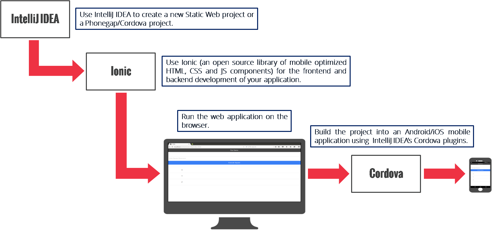
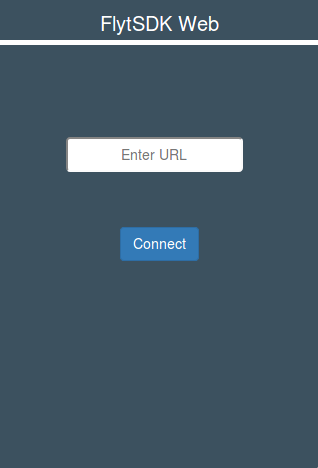
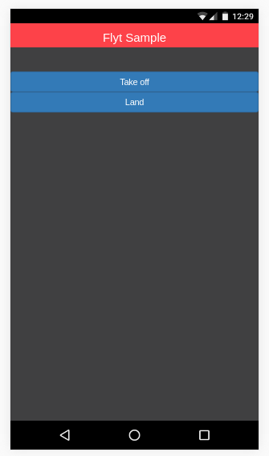
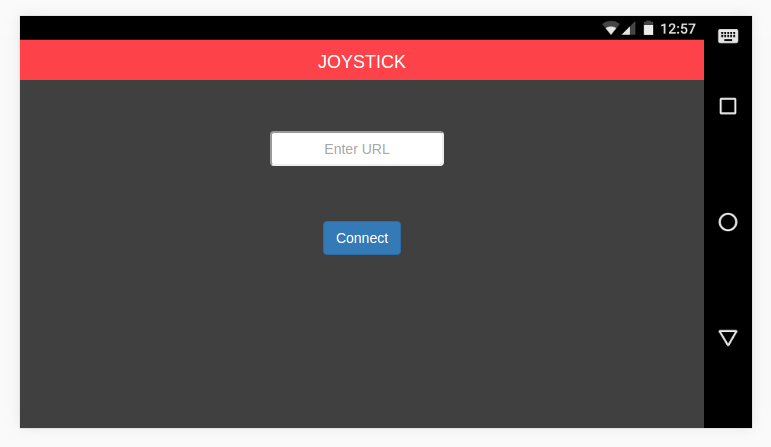
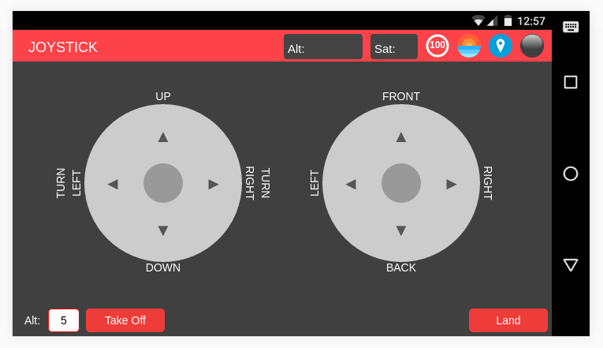

# Android App- HTML,CSS,JS \(Cordova\)

## Introduction

This document deals with the instructions and step by step guide for creating Mobile apps for your Drone. There are two ways of doing so. The conventional way is to build a mobile app in JAVA using IDEs such as Eclipse or Android Studio. The other way of going about creating mobile apps is to reuse the Web app code i.e a simple HTML, CSS and JS project and convert that into a mobile app using frameworks such as Cordova and Phonegap. This allows for sharing the same codebase for creating cross-platform mobile apps.

Here in the second approach we develop an android app with HTML, CSS, JS/Jquery using Cordova engine. These apps will allow you to remotely monitor and command your drone. You will also see how to get custom data from the Drone on your app. The IDE that we have selected for this approach is IntelliJ Idea. The GUI and the client side coding is done in HTML, CSS and JS/Jquery, reused code from Web Apps to create Mobile Apps.



## Development Environment Setup

For a quick start, you can follow the steps given below to install Ionic, Cordova and IntelliJ IDEA:

* Please install Node.js v4 \(Node.js v5 does not work at the moment with Ionic\). To install node.js go to this [link](https://nodejs.org/en/download/). This will also install the node package manager npm.
* Using npm install the latest Ionic and Cordova:

  ```text
  $ sudo npm install -g cordova ionic
  ```

* Follow the [Android](http://cordova.apache.org/docs/en/5.1.1/guide/platforms/android/index.html) and [iOS](http://cordova.apache.org/docs/en/5.1.1/guide/platforms/ios/index.html) platform guides to install required platform dependencies \(SDKs\).


**Note:**  **Follow this step for Mobile app development only.** iOS development requires Mac OS X. iOS simulator through the Ionic CLI requires the ios-sim npm package, which can be installed with the command `sudo npm -g install ios-sim`.


*  IntelliJ IDEA also requires JDK 1.6 or higher. To install JDK 7 go to [this link](https://www.digitalocean.com/community/tutorials/how-to-install-java-on-ubuntu-with-apt-get).


**Important:** Please install JDK before installing Android Studio or Android SDK Tools.


*  Go to the [link here](https://www.jetbrains.com/idea/download) to install IntelliJ IDEA.

## Create a new Project

Follow the steps below to get create a mobile app :

1. Launch IntelliJ IDEA and click on create new project.
2. Select **Static Web** in the new window on the left side.
3. Make sure **PhoneGap/Cordova App** is selected on the right and click on next.
4. Fill up details of your project viz. Project Name and Project Location. Click on Finish.
5. New project opens up. You can create/edit your HTML, CSS and JS/Jquery files here.

The front end of the app is developed in HTML, CSS, JS/Jquery .

To start building an Android App using Cordova all you need to do is, add the files of [FlytSDK Web](https://downloads.flytbase.com/flytos/downloads/sdk/Flyt_Web_SDK.zip) to this project and build your App like you would a Web App \(editing the app.html and app.js files\).

## Build and Run the Project

You can build and run the app using IntelliJ IDEA in either a browser based emulator or load the app on your mobile device.

**Running in Browser:**

* Go to **view**.
* Click on the **Open in browser** option.
* Select the browser of your choice.

**Running in Device:**

* Connect mobile device to computer using a USB cable.
* Select **Specify target** in IntelliJ Idea corresponding to your device \(Refresh if necessary\).
* Click on **Run** button to start building your app and to install it on the device.

## Sample Mobile Application

In the earlier section we had built a Web app for the drone, we can also build an Android/iOS application by converting this Web app using Cordova. This application allows you to trigger an on-board service to takeoff and land the drone from your mobile device.

You just need to connect to the FlytOS running system by entering the **URL** in the first App screen.





You can Also try out [Flyt Joystick](https://downloads.flytbase.com/flytos/downloads/apk/Flyt-Joystick-mode-2.apk) app or view the code from the [repository](https://github.com/flytbase/flytsamples/tree/master/Mobile-Apps/HTML-JS-Apps/Joystick):

* Install or build the app and launch it.
* Enter the IP of the device running FlytOS to be able to communicate with it.



* Once the IP is confirmed you are redirected to the app screen.
* This App allows the user to send the drone velocity setpoints and control the drone as with a regular joystick.

**Things to Remember**

* You need to takeoff before you can use the joystick to control your drone.
* The left joystick gives the drone commands to move up, down, turn-left and turn-right.
* The right joystick gives the drone commands to move front, back, left and right.
* All the commands are given with respect to the drone\(front = direction of the nose/front of the drone\).



