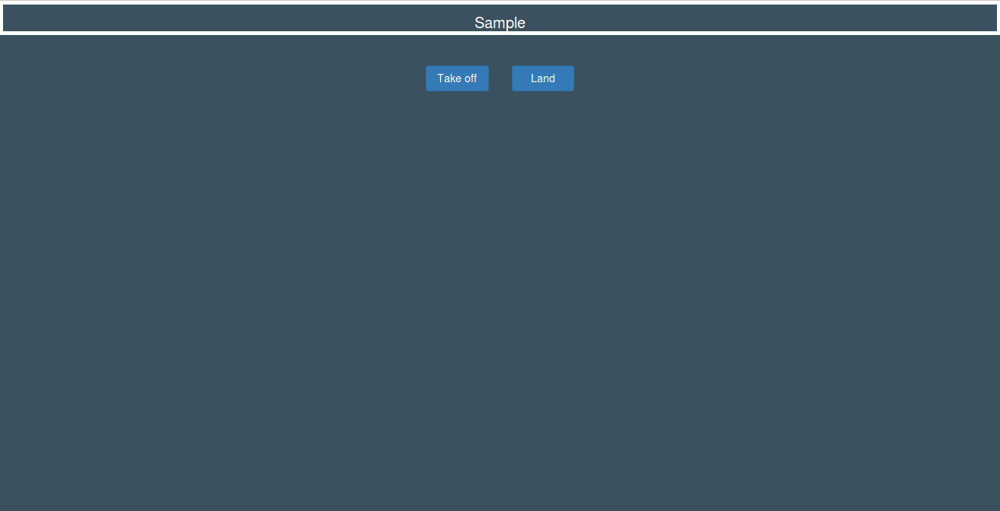
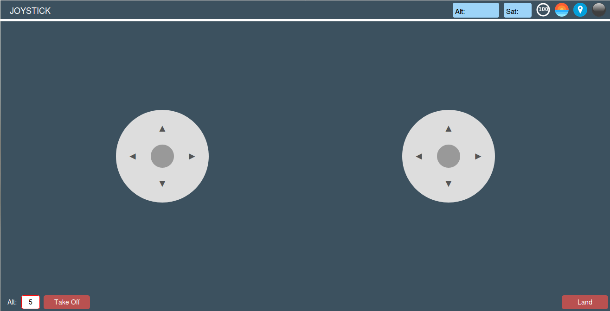

# Remote Web

## Introduction

Web apps provide an easy way to interact with the drone. These apps use the RESTful and Websocket FlytAPIs. There are several sample web apps available on [Flytsamples github](https://github.com/flytbase/flytsamples). Here we will go through the steps to create your own custom web app.

### Create a New Project

* We have put together a [Web SDK](../../flytsdks/#web-sdk) for Flytbase to help speed up the process of building your custom app
* You can download the SDK [here](https://downloads.flytbase.com/flytos/downloads/sdk/Flyt_Web_SDK.zip) and follow the [instructions](../../flytsdks/) to get a “Hello World” app up and running.
* The SDK has a **URL** screen and websocket initialisation code pre-integrated. This helps to establish connection and access telemetry data which is required for all the apps
* All your app specific UI components and JS code goes in app.html and app.js respectively.
* Next step is to add specific UI components and respective socket or REST calls from the [API documentation](http://api.flytbase.com/) to the above mentioned files and you are good to go.

### Deploying the App

There are two ways to deploy web apps built using FlytAPIs. One option is to deploy an app on the onboard web server within FlytOS or alternately the app can be deployed remotely on your own custom server.

#### **Deploying on Onboard Server**

* Go into the folder /flyt/flytapps/web/.
* Create a folder for your Web app, eg sampleApp.
* Inside th samplApp folder create a folder named static and paste the contents of your Web app folder inside this folder.
* Create an empty document named \_\_init\_\_.py and views.py alongside static folder.
* Open the views.py file and write the following code:

```text
from flask import Blueprint, render_template

sampleApp = Blueprint('sampleApp', __name__,static_folder='static')

@sampleApp.route('/')
def timeline():
  return sampleApp.send_static_file('index.html')
  #index.html is the page that is rendered when your custom webapp is fired.
```

* Now come back to /flyt/flytapps/web/ and add an entry for your sampleApp in apps.py file.

```text
from flask import Blueprint, render_template, Flask

from .user_app1.views import user_app1
from .sampleApp.views import sampleApp

def register_user( main_app ):
  main_app.register_blueprint(user_app1,url_prefix='/user_app1')
  main_app.register_blueprint(sampleApp,url_prefix='/sampleApp')
```

* Now restart the FlytOS and your web app will be served at &lt;URL&gt;/sampleApp .
* You can also try out other Sample Apps in the [repository](https://github.com/flytbase/flytsamples/tree/master/Web-Apps).

#### **Deploying on Remote Server**

You can deploy the app on a remote server of your choice. The HTML/JS/CSS code of the app will typically go in the static directory while the server side code will depend on the server stack used. The SDK has an initial connection page which is useful in remote deployment to provide the URL\(IP\) of the system running FlytOS. The internal REST/WebSocket calls are then routed accordingly. Here are the steps for a sample remote deployment using a simple flask dev server:

* Create a folder for your Web app, eg sampleApp.
* Inside the samplApp folder create a folder named static and paste the contents \(HTML/JS/CSS\) of your Web app folder inside this folder.
* Create an empty document named \_\_init\_\_.py and sampleapp.py alongside static folder.
* Open the sampleapp.py file and write the following code:

```text
#!/usr/bin/python


from flask import Flask

# Setup Flask app.
app = Flask(__name__)
app.debug = True


# Routes
@app.errorhandler(Exception)
def unhandled_exception(e):
  return str(e),500

@app.route('/')
def root():
  return app.send_static_file('index.html')


if __name__ == '__main__':

    app.run(host='0.0.0.0',
      port=80,
      debug=True,
      use_reloader=True)
```

* To start the server, run the following command on command line from within your app directory :

```text
$ sudo python sampleapp.py
```

* To view your app, open a browser and go to http://&lt;URL of server&gt;


**Note:** This is only a dev server and for production deployment with flask you can check the options [here](http://flask.pocoo.org/docs/0.12/deploying/#deployment)


## Sample Web Application


**Note:** The source code for the sample web/mobile apps is available in [github repository](https://github.com/flytbase/flytsamples/tree/master/Web-Apps) for your reference.


Following is a simple demonstration of how to run a Web application for your drone. This application allows you to trigger an on-board service that sends commands to your drone to takeoff and land.



You can Also try out [Joystick](https://downloads.flytbase.com/flytos/downloads/webApps/Joystick.zip) Web app :

* Launch the index.html file in your browser.
* Enter the IP of the device running FlytOS to be able to communicate with it.


* Once the IP is confirmed you are redirected to the app screen.
* This App allows the user to send the drone velocity setpoints and control the drone as with a regular joystick.

**Things to Remember**

* You need to takeoff before you can use the joystick to control your drone.
* The left joystick gives the drone commands to move up, down, turn-left and turn-right.
* The right joystick gives the drone commands to move front, back, left and right.
* All the commands are given with respect to the drone\(front = direction of the nose/front of the drone\).



