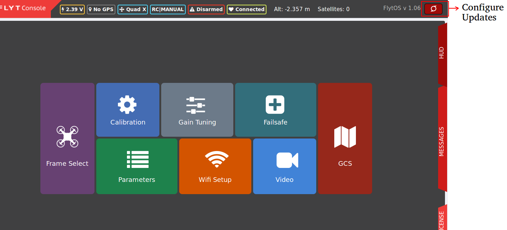
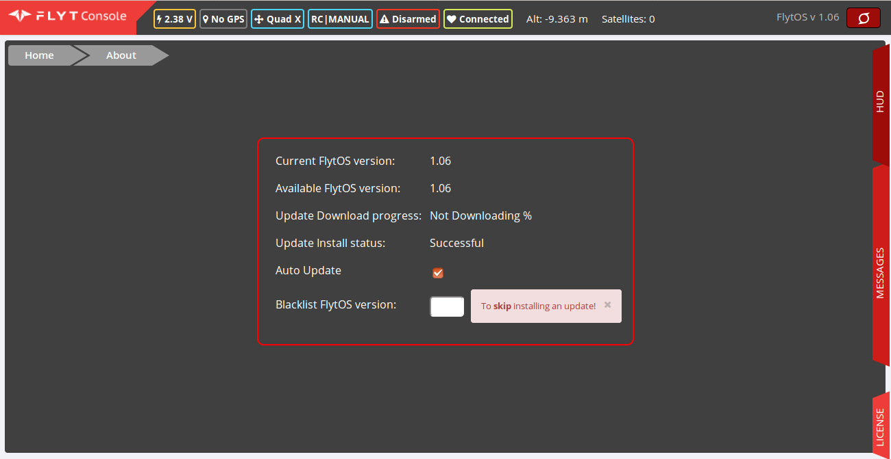
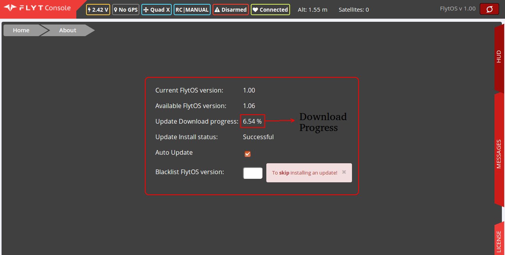
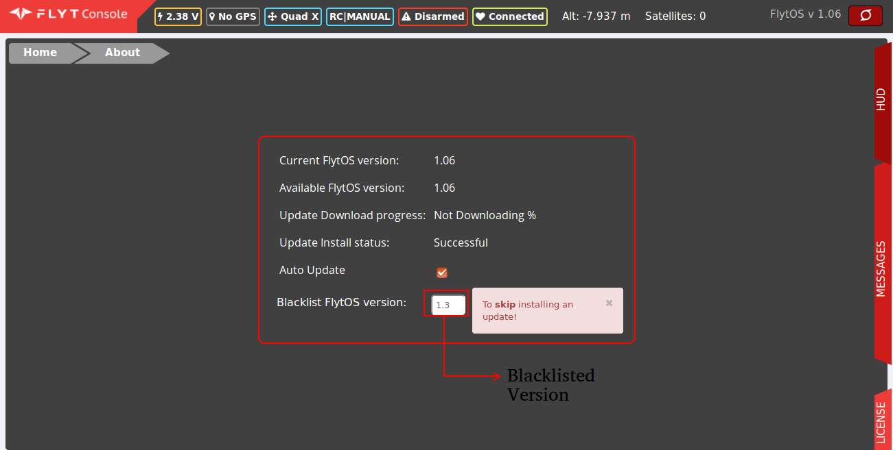

# FlytOS Updates

## Automatic OTA


**Caution:** You must activate your device, without which auto-updates will not work.


* Apart from the option of manually downloading and installing the latest FlytOS debian, FlytOS has a built in auto-update functionality.
* Whenever a flight computer with FlytOS installed on it has internet access at boot, it checks for possible updates and downloads them.
* Once the download is complete, the updates are installed upon the next reboot of your device.
* Reboot your device once the download is complete. Installation of the update would be triggered automatically.
* Please wait for a few minutes before trying to connect to FlytOS.

## Configure Updates

The auto-update process is configurable as per user needs. This section explains the different configuration options available and possible debugging methods.

* To configure updates launch FlytConsole and click on Update manager on the top right corner of FlytConsole.



* The update manager displays important information about FlytOS viz. Current FlytOS version, Available FlytOS version, Update download progress, Install status and Blacklisted FlytOS versions.



* **Current FlytOS version** displays the currently installed FlytOS version.
* **Available FlytOS version** displays the latest FlytOS update available in our server.
* You can disable or enable auto-updates anytime using the **Auto Updates** checkbox. If Auto Update field is checked and a new update is available, it will get downloaded in the background, if the device has internet connection.
* You can also monitor the progress of update being downloaded from the **Update Download progress** field.



*  In case there is some version of FlytOS that does not install correctly, or you want to skip that update completely, you can blacklist that version by entering it in the **Blacklist FlytOS version** field. FlytOS will no longer try to update to the Blacklisted FlytOS version. When another higher version is available to download, FlytOS will automatically download and install that version.



## Startup Log

The Startup log located at /flyt/logs/startup/flyt\_startup.log contains a log of important startup events including any errors in updates or installation.

For debugging: In case the updates are not installed successfully or you are unable to open FlytConsole, you can check the startup log to locate the error. You can view the log in a terminal using the following command:

```text
$ cat /flyt/logs/startup/flyt_startup.log
```


**Note:** For more help regarding auto updates, please post your queries in the [FlytBase forum](http://forums.flytbase.com/) with the the startup log attached.


