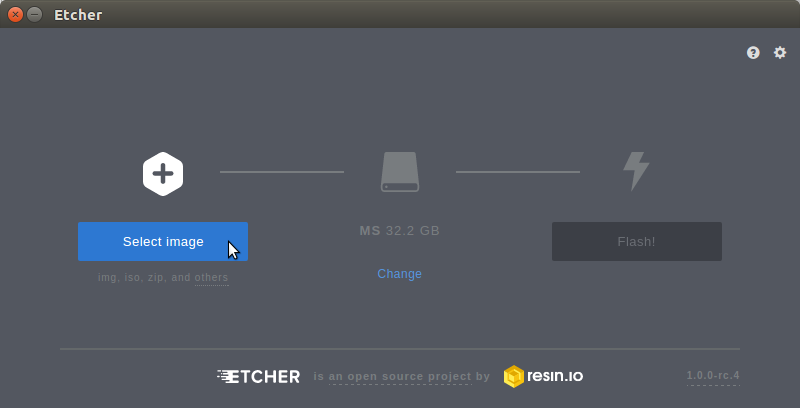
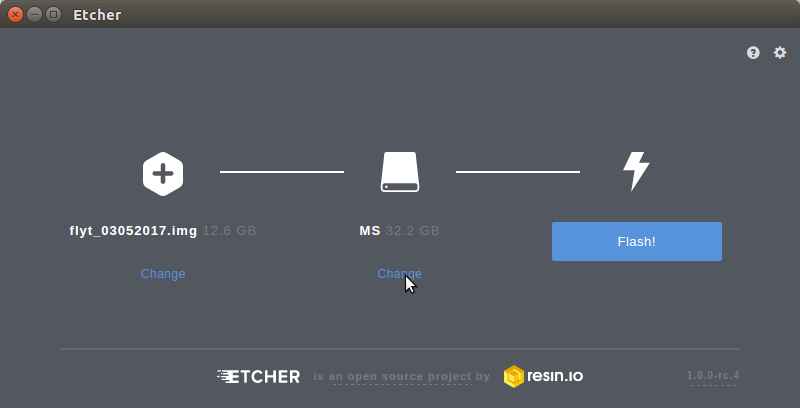
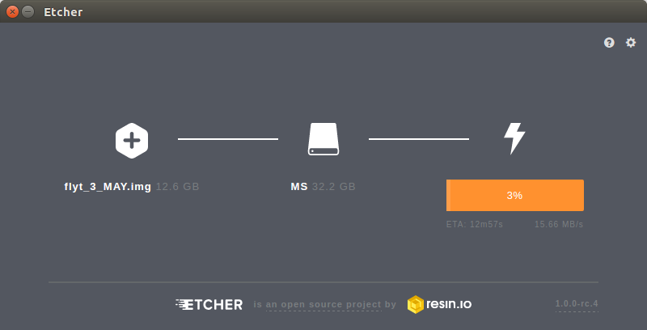

# Flashing FlytOS Linux Image \(RPi 3B/3B+\)

This section will help you in flashing FlytOS Linux Image on any SD card for your Raspberry Pi 3B/3B+. This step requires you to have a registered FlytBase account. In case you don’t have an account, [create a FlytBase Account](../../create-flytbase-account.md) before you proceed.

## Image download

* [Login](https://my.flytbase.com/) to your FlytBase Account.
* Download the hardware specific FlytOS Linux Image from below table.



 Download the RPi 3B FlytOS Linux Image from [here](https://my.flytbase.com/downloads/flytos/).



Download the RPi 3B+ FlytOS Linux Image from [here](https://drive.google.com/file/d/107dYt8CbzbNFJGbCdA5P4MLu0DT5Yafr/view?usp=sharing).


**Warning:** Skip MD 5 Hash Verification for RPI 3B+




* Download size of the image is about 2.5 GB's.
* Check _MD 5 Hash_ to verify the integrity of downloaded file. Since it is a large file, the commands may take a few minutes to complete



Launch a terminal and execute the following command

```text
$ md5sum <path-to-downloaded-image>/flyt*.img.gz
```



Launch a command window and execute the following command

```text
$ CertUtil -hashfile <path-to-downloaded-image>/flyt*.img.gz MD5
```



Launch a terminal and execute the following command

```text
$ md5 <path-to-downloaded-image>/flyt*.img.gz
```



* Compare the MD 5 Hash generated to _MD 5 Hash_ mentioned in the [FlytOS Linux Image](https://my.flytbase.com/FlytOS) download page. 
* Uncompress/extract the downloaded image:

## Image write to SD Card

We recommend using [Etcher](https://etcher.io/) for burning images to SD/eMMC cards. To burn an image to your SD/eMMC card:

* Download Etcher for your Operating System \(OS X, Linux, Windows\).
* On opening you will be greeted with the following screen.



* Select your downloaded image.
* Choose the bootable drive \(SD/eMMC Card\) to burn the image onto \(Please note that Etcher detects pen drives as bootable disks so proceed with caution\).



*  Click on **Flash**.



Etcher will burn the image onto the SD/eMMC card and verify the image. Remove the SD card after you get the prompt.

After performing the above steps, your FlytOS SD Card is ready. Insert the card in Raspberry Pi’s SD Card slot and power ON the Pi to start booting FlytOS.


**Warning:** Since the image is of only around 11.5 GB's, the rest of the SD/eMMC Card would have unallocated memory. DO NOT forget to expand SD/eMMC card partition.


## Partition Expansion on Raspberry Pi

After you burn the Raspberry Pi FlytOS image, the rest of the SD Card has unallocated space. As this limits the available user area it is advised to extend your partition on your **first boot up**.

To extend your partition to cover your full SD card, execute the following steps.

You will need to connect your Raspberry Pi to the internet. As the internal WiFi is being used as an Access Point, internet can be provided through either an Ethernet cable or through the USB port by connecting a WiFi dongle or using an Android phone in USB Tethering mode.

* Run the following command in system terminal

  ```text
  $ sudo apt-get update
  ```

* Download raspi-config

  ```text
  $ sudo apt-get install raspi-config
  ```

* On successful installation of raspi-config run

  ```text
  $ sudo raspi-config --expand-rootfs
  ```

* After execution you will be asked to reboot your system

  ```text
  $ sudo reboot
  ```

* On restart your partition has will be extended to cover your full SD Card and is now ready to use.

## WiFi Setup

Insert the SD Card in your Raspberry Pi 3 after flashing [FlytOS Linux image](http://docs.flytbase.com/docs/FlytOS/GettingStarted/FlashingImgRpi.html#flashing-img-rpi) on it and apply power to boot it. On boot up a WiFi access point is created on the device with following credentials:

> **ssid: flytos\_WiFi  
> password: flytos123**

Connect to the access point on another computer. Open the following link in your browser to view [FlytConsole](../../../../about-flytconsole/flytconsole.md): [http://10.42.0.1/flytconsole](http://10.42.0.1/flytconsole)

## User Credentials

All FlytOS Linux Image versions have the same Login user credentials:

> **username : flytos  
> password : flytos**

## Now let's get back Installation Guide



